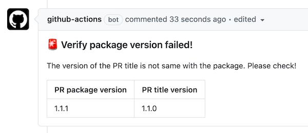

# 🙏 Verify Package Version

Verify your package version whether meets some conditions.

Currently only PR triggering is supported, and more scenario requirements can be raised through [issue](https://github.com/actions-cool/verify-package-version/issues).

## Preview

- [#6](https://github.com/actions-cool/verify-package-version/pull/6)




## How to use ?

```yml
name: Verify Package Version

on:
  pull_request:
    types: [opened, edited, reopened, synchronize, ready_for_review]

jobs:
  verify:
    runs-on: ubuntu-latest
    # Add conditions to trigger more effectively
    if: contains(github.event.pull_request.title, 'changelog')
    steps:
      - uses: actions/checkout@v2
      - name: verify-version
        uses: actions-cool/verify-package-version@v1.1.1
        with:
          title-include-content: 'docs'
          title-include-version: true
          open-comment: true
```

- `title-include-content`: Verify that the title contains content
- `title-include-version`: Verify that the title whether contains version, default `true`
- `open-comment`：Whether to open comments, default `false`

## Note

- When set `open-comment`, the ref of PR must be in the current repositorie
- When use `1.1.0+` and PR ref is base branch, it will use `fs.readFileSync`. This requires you add `- uses: actions/checkout@v2`

## Changelog

[CHANGELOG](./CHANGELOG.md)

## 💖 Who is using?

<table>
  <tr>
    <td align="center" width="180">
      <a href="https://github.com/ant-design/ant-design">
        
        <div>ant-design</div>
      </a>
    </td>
  </tr>
</table>


## LICENSE

[MIT](https://github.com/actions-cool/verify-package-version/blob/main/LICENSE)
